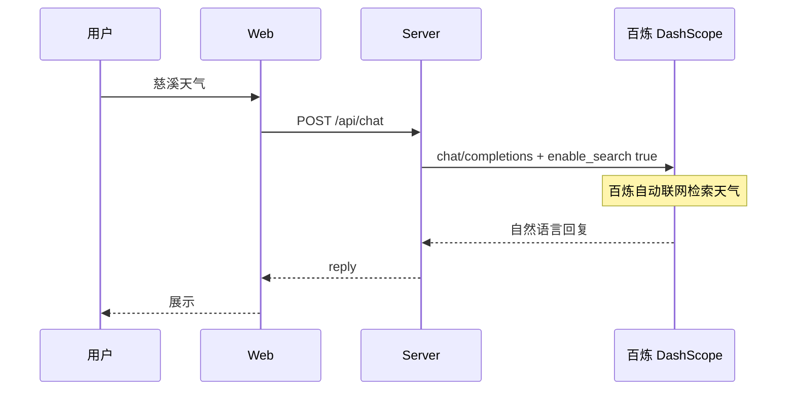

# 天气助手 · 阿里百炼 Skill

## 项目概览

| 路径 | 作用 |
|------|------|
| `web/` | 天气对话前端 |
| `server/index.js` | Express：代理百炼 `chat/completions` + `enable_search` |
| `.env` | `DASHSCOPE_API_KEY`（勿提交 git） |

天气数据**不**由本项目拉取，由百炼 **联网搜索** 在云端完成（与控制台问天气一致）。

## 对话流程



## 百炼 API 要点

- **端点**: `POST {BASE_URL}/chat/completions`
- **联网**: 请求体顶层 `"enable_search": true`（Node 兼容模式）
- **模型**: 需支持联网（qwen-plus、qwen3-max 等）

```json
{
  "model": "qwen-plus",
  "messages": [...],
  "enable_search": true
}
```

文档：[联网搜索](https://help.aliyun.com/zh/model-studio/web-search) · [OpenAI 兼容 Chat](https://help.aliyun.com/zh/model-studio/qwen-api-via-openai-chat-completions)

## 环境变量

- `ENABLE_SEARCH` — 默认 true；设为 `false` 关闭联网（仅模型常识，不推荐查天气）
- `DASHSCOPE_MODEL` — 与控制台可用模型一致

## 维护时注意

- 改人设：`server/index.js` 的 `SYSTEM_PROMPT`
- 勿在代码/Skill 中写真实 API Key
- 若天气不准：检查模型是否支持联网、账户是否开通搜索；与控制台对比同一模型

## 常见问题

| 现象 | 处理 |
|------|------|
| 503 未配置 Key | 创建 `.env` 填入 `DASHSCOPE_API_KEY` |
| 回答像瞎编、无实时数据 | 确认 `ENABLE_SEARCH=true`，模型支持联网 |
| 与控制台不一致 | 对齐 `DASHSCOPE_MODEL` 与地域 `BASE_URL` |
